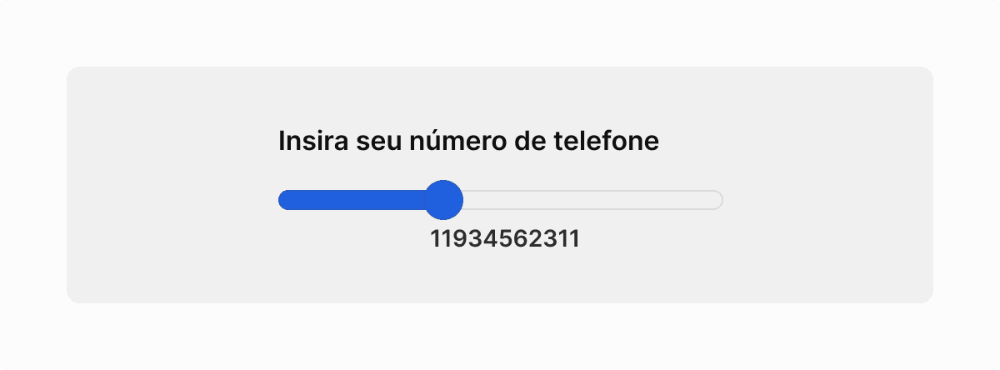
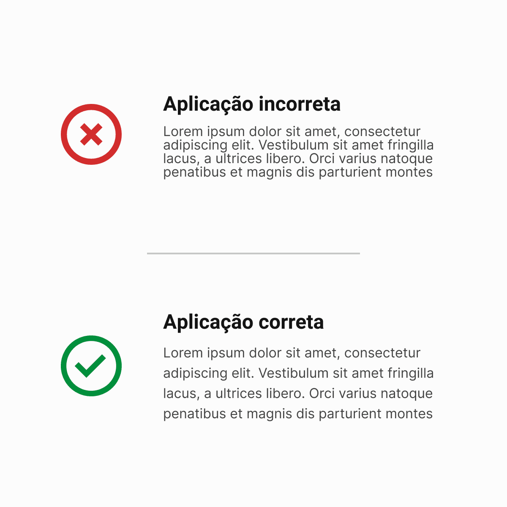

O primeiro ponto que precisamos nos atentar ao falar de acessibilidade é que **nem sempre estamos ajudando as pessoas; às vezes, podemos apenas estar atrapalhando sua compreensão**. Isso acontece porque, muitas vezes, os autores não têm conhecimento suficiente sobre conteúdos e interfaces acessíveis e, ao tentar construir algo acessível, acabam focando na criação baseada em suas próprias opiniões — e não nas boas práticas de acessibilidade.

> "Hoje eu refleti sobre uma coisa: como posso me considerar Sênior sendo que não sei sequer o básico de Acessibilidade?" — **_(Designer de Produto de uma consultoria global)_**

Essa realidade fica evidente quando analisamos a diferença significativa entre o número de desenvolvedores e designers sem deficiência e aqueles que possuem alguma deficiência — independentemente de qual deficiência estamos nos referindo. Como resultado, as interfaces disponíveis na web, atualmente, são altamente orientadas ao visual, priorizando efeitos gráficos, ícones elaborados e outras abordagens que visam oferecer uma **ótima percepção estética**.

Porém, essa ênfase no visual frequentemente deixa de lado a verdadeira acessibilidade, criando soluções que atendem ao 'atrativo estético', mas excluem pessoas com necessidades específicas — reforçando a importância de pensar além do esteticamente bonito e focar em interfaces inclusivas de forma ampla e consistente.

## As perspectivas dos usuários com deficiência

Agora, sabendo que grande parte dos desenvolvedores e designers não possuem deficiências, fica mais claro por que, muitas vezes, as necessidades de usuários com limitações específicas são negligenciadas. Essa disparidade reflete diretamente na forma como interfaces são projetadas: priorizando o apelo visual, com efeitos gráficos elaborados e layouts esteticamente agradáveis, mas que frequentemente ignoram questões essenciais de acessibilidade.

> "Será que a sua solução também é tão impactante sem imagens, animações e os aspectos visuais?"

Refletir sobre esse tópico é fundamental para entender como soluções podem criar novos problemas ao desconsiderar diferentes perspectivas. Vamos explorar algumas dessas visões e os desafios que elas trazem:

### Perspectiva Daltônica: Cores que todos enxergam

Você já parou para pensar se a sua paleta de cores faz sentido para pessoas daltônicas? Não adianta ter um design lindo e cheio de status visuais se as pessoas não conseguem identificar o que significa um "verde positivo" ou um "azul para revisar". Testar contrastes, criar alternativas visuais (como ícones ou texturas) e garantir que sua interface funcione **mesmo sem cores** é essencial.

### Perspectiva dos Deficientes Auditivos: Não é só sobre ouvir

Muita gente não sabe, mas nem todos os deficientes auditivos se comunicam da mesma forma. Enquanto alguns dependem de Libras ou outras Línguas de sinais, outros são oralizados e leem os textos da interface normalmente. Então, será que a sua solução considera estes casos? Uma aplicação que não depende só de textos, mas que também usa representações visuais e ícones claros pode ser a chave para incluir um público maior.

### Perspectiva dos Deficientes Visuais: Layouts consistentes para todos

Um layout pode parecer impecável aos olhos, mas será que ele faz sentido para quem usa leitores de tela? Imagine que no desktop a ordem das informações é uma e, no mobile, ela se inverte. Isso cria uma experiência confusa para, por exemplo, os deficientes visuais que dependem da consistência e hierarquia lógica para navegar na aplicação. Teste sempre com ferramentas de leitura e priorize a clareza.

### Perspectiva dos Deficientes Cognitivos: Menos distrações, mais foco

Animações legais, botões piscando e vídeos em looping podem parecer geniais... até não serem. Essas funcionalidades podem facilmente sobrecarregar quem tem dificuldades de concentração ou processamento cognitivo. Dica de ouro: ofereça controle! Deixe que as pessoas escolham pausar animações, desativar sons ou simplesmente ajustar a experiência para algo mais simples.

### Perspectiva dos Deficientes Motores: Navegação que respeita limites

Arrastar, girar, resolver puzzles... tudo isso pode ser atrativo, mas pode excluir pessoas com mobilidade reduzida. Pense em quem usa o teclado ou tecnologias assistivas para navegar: será que sua interface funciona bem com _tabs_? Se a resposta for "não", é a hora de ajustar o foco para acessibilidade nos controles de interações.

---

Esses são apenas alguns exemplos de como a falta de perspectiva pode transformar boas intenções em obstáculos reais. Mas como criar interfaces considerando boas práticas? Vamos entender um pouco mais sobre como criar designs de interface acessíveis.

## Criando interfaces acessíveis

Criar e desenvolver interfaces pode parecer, à primeira vista, algo extremamente simples. Afinal, é só pegar algumas referências, criar um protótipo bonito, juntar códigos aleatórios da internet e pronto, certo?

> "Acessibilidade não é somente um termo médico que se aplica a alguma certa porcentagem da população. Acessibilidade é algo que abrange a todos nós, você e eu, todos os dias. O que nós criamos é inútil se não for acessível." — **_(Emanuel G. de Souza)_**

É justamente essa ideia de "facilidade" que faz muitos desenvolvedores e designers errarem na entrega de suas soluções, violando critérios importantes de acessibilidade e resultando em produtos finais que não contemplam aspectos essenciais, como:

- **Tamanho de fonte adequado**
  - Texto legível é um direito, não um luxo. 16px é o tamanho mínimo recomendado para corpos de texto. Usar tamanhos menores, como 10px ou 12px, pode excluir uma grande parte do público, forçando-os a usar zoom para conseguir ler conteúdos.

- **Epaçamento mínimo entre linhas**
  - Uma boa leitura depende de espaçamento adequado. O ideal é que o espaçamento entre as linhas seja de 1.5x o tamanho da fonte. Já o espaçamento entre parágrafos deve ser 1.5x maior que o espaçamento entre linhas, com exceções dependendo da fonte utilizada.

- **Textos de links claros e informativos**
  - Os famosos _call to action_ precisam ser objetivos e informativos. Evite textos genéricos como "Clique aqui" ou "Saiba mais". Eles não oferecem contexto suficiente e são confusos para quem usa leitores de tela
  - **Exemplo incorreto:** "Ainda não abriu uma conta? <u>Saiba mais</u>" \ "<u>Clique aqui</u> e descubra nossa solução."
  - **Exemplo correto:** "Ainda não abriu sua conta? <u>Abra agora uma conta digital</u>" \ "Acesse e <u>aprenda mais sobre o nosso produto</u>."
- **Navegação via teclado**
  - Menus devem ser totalmente navegáveis via teclado, com estados de foco bem definidos que indiquem onde o usuário está na navegação, além de uma hierarquia coerente para submenus e elementos que respeite a ordem lógica da página.
- **Áreas de clique e toque acessíveis**
  - Facilite a vida dos usuários! Áreas de toque devem ter no mínimo 44px para garantir que as ações possam ser executadas sem dificuldade, mesmo em dispositivos móveis.

- **Conteúdo acessível para todos os públicos**
  - Conteúdo multimídia, como áudio e vídeo, devem ser acompanhados de legendas inseridas manualmente ou revisadas quando feitas automaticamente e, sempre que necessário, de transcrições completas para garantir o acesso ao conteúdo de forma alternativa.

Além disso, podemos adotar algumas práticas durante a construção dessas interfaces, garantindo, no mínimo, a conformidade com o Nível A de Acessibilidade — a base essencial para criar experiências mais inclusivas e funcionais para todos.

### Lidando com formulários

As áreas de inserção e edição de dados — ou os famosos formulários — estão em praticamente todas as aplicações. Entretanto, mesmo sendo algo tão presente, muitas aplicações possuem formulários que carecem de cuidados essenciais, tais como:

- **Fácil preenchimento:** Forneça auxílio sobre o formato dos dados, deixando claro o que deve ser inserido em cada um dos campos; mantendo-os compreensíveis mesmo após preenchidos.
- **Prevenção de erros:** Valide os campos enquanto o usuário está preenchendo, não permitindo inserções incorretas e, consequentemente, evitando frustrações ao término do preenchimento.
  - **Auxílios de pós-erro:** Erros podem acontecer, mas a sua interface precisa estar preparada para ajustar o usuário a entender o que está errado e como corrigi-lo.
- **Feedbacks:** Mostre se o campo está sendo preenchido de maneira adequada através de feedbacks visuais e iconografias.

### Desenhando Gráficos

Certamente, gráficos são ótimas ferramentas para apresentar dados de forma clara e enxuta nas interfaces. Porém, eles também podem gerar grandes problemas de acessibilidade — seja pelas cores, pelos textos pequenos ou até mesmo pela ausência de informações não visuais que expliquem os dados apresentados.

Para minimizar esses problemas, aqui estão algumas estratégias práticas que podem ajudar:

1. **Não dependa apenas de cores:** Combine cores com descrições ou texturas para diferenciar as informações e auxiliar pessoas daltônicas.
2. **Legendas e _tooltips_ informativos:** Sempre inclua textos complementares que expliquem os números, porcentagens ou outros detalhes apresentados no gráfico.
3. **Adote texturas e padrões:** Use padrões visuais para diferenciar elementos, como barras e colunas, tornando a identificação mais fácil.
4. **Prefira gráficos de barras e colunas:** Esses formatos são mais intuitivos e fáceis de interpretar, especialmente quando comparados a opções mais complexas, como _Scatter Charts_ ou _Gantt Charts_;

### Adicionando recursos acessíveis

Construir aplicações acessíveis não se limita apenas ao design ou código. Podemos também oferecer recursos que permitam ao próprio usuário personalizar e manipular a interface de acordo com suas necessidades, como:

- **Alto contraste:** Inclua uma opção para alternar para um modo de alto contraste, facilitando a interpretação para pessoas com dificuldades visuais.
- **Aumentar/Diminuir fonte e layout:** Permita que o usuário ajuste o tamanho da fonte e a estrutura da interface sem causar quebras ou prejuízos no layout.
- **Teclas de atalho:** Desenvolva atalhos de teclado que facilitem a navegação, permitindo acessar rapidamente headings, links e outras áreas importantes do site.

#### Contraste em elementos

Ao desenvolver componentes e estruturas para a interface, é essencial garantir que a cor do texto e do background estejam sempre contrastantes. Isso exige um estudo cuidadoso da paleta de cores utilizada na aplicação.

Para corrigir e melhorar o contraste, algumas dicas práticas incluem:

- **Utilizar ferramentas de contraste:**
  - **AcessibleWEB:** WCAG Color Contraste Checker.
  - **WebAIM:** Contraste Checker.
- **Elaborar uma paleta de cores bem planejada:**
  - Crie variações claras e escuras das cores principais para garantir flexibilidade no design.
  - Evite usar extremos como 100% branco ou 100% preto, pois esses contrastes muito fortes podem causar desconforto visual e prejudicar o equilíbrio da paleta.

## Deficientes Visuais — como eles navegam na web?

Para pessoas com deficiência visual, a navegação acontece de uma forma muito diferente da tradicional: ao invés de ver a interface, **eles a escutam** . Isso significa que a ordem, os textos, os rótulos e a estrutura visual que você deseja precisará fazer sentido quando **virarem som**.

> "Construa o seu site pensando nas regiões com menos acesso à informação. Como eles leriam a sua aplicação?"

Leitores de tela, disponíveis tanto em dispositivos móveis quanto em computadores, são tecnologias assistivas que ajudam essas pessoas a navegar e consumir conteúdos digitais; podendo ser nativos, como nos sistemas operacionais móveis, ou fornecidos por aplicações de terceiros.

> "O termo Tecnologia Assistiva [...] refere-se a recursos que contribuem para que pessoas com deficiência possam ter uma vida mais independente e autônoma." — **_(eMAG)_**

Existem diversas ferramentas de leitura de tela — como NVDA, JAWS, VoiceOver e TalkBack — cada uma com características específicas e compatibilidade com diferentes sistemas operacionais. Por isso, testar seu design em diferentes dispositivos é essencial para garantir uma experiência auditiva.

### Leitores para Desktop

Nos computadores, a navegação do usuário com deficiência visual varia de acordo com o navegador e o nível de acessibilidade do site, aplicativo ou ferramenta que ele está utilizando.

Além disso, vale lembrar que a interação desses usuários é, na maior parte do tempo, feita através do teclado. As principais ações incluem:

- **Setas do teclado**: Para navegar pelo texto e conteúdo geral.
- **Tecla 'Tab'**: Para pular entre links e elementos interativos.
- **Atalhos configurados**: Para navegar por títulos, seções e outros elementos importantes da interface.

Entre os leitores de tela mais utilizados para desktop destacam-se: **DosVox** e **JAWS**.

#### Sistema DosVox

O DosVox é um sistema simples e interativo, amplamente utilizado no Brasil. Ele se destaca pela comunicação constante com o usuário, mas tem uma limitação importante: funciona apenas com programas exclusivos do software, como:

- **CartaVox:** Ferramenta para envio e recebimento de e-mails.
- **WebVox:** Navegador interno para acessar a internet.

Por essa restrição, o DosVox não interage diretamente com programas do mercado, sendo uma solução mais voltada para atividades específicas no ecossistema do próprio software.

#### JAWS

O JAWS é um dos leitores de tela mais populares por sua capacidade de interagir com a maior parte dos programas disponíveis atualmente. No entanto, por tentar "adaptar as coisas aos cegos", muitas vezes ele enfrenta problemas — já que a maioria das soluções modernas não são verdadeiramente acessíveis. Além disso, trata-se de um **software pago**, o que pode limitar seu acesso para algumas pessoas.

### Leitores para Mobile

Ao falarmos de dispositivos móveis parece que entramos em um mundo paralelo. Esses aparelhos oferecem diversas opções de acessibilidade nativa, facilitando a interação por meio de tecnologias como o **VoiceOver** (iOS) e o **TalkBack** (Android).

Navegar em dispositivos móveis é naturalmente mais intuitivo, graças a funções acessíveis como:

- **Exploração por toque:** Permite que o usuário localize elementos na tela apenas tocando-os.
- **Rolagem automática:** Facilita a navegação em listas e páginas longas.
- **Gestos configuráveis:** Oferece personalização para ações específicas, adaptando-se às preferências do usuário.
- **Funções de 'varrer':** Permitem navegar entre elementos da tela deslizando o dedo.
- **Acesso com dois toques:** Simplifica a seleção de itens ao confirmar toques com um gesto duplo.

Ao projetar uma interface, pense além do que está na tela. Pergunte-se: "Se eu não estivesse vendo nada, faria sentido o que eu estou ouvindo?" Um design acessível fala com todos, mesmo que ninguém esteja olhando — principalmente quando estamos nos referindo a imagens.

## Descrições de imagens

Uma vez compreendido como os usuários com deficiência visual navegam na web, é essencial considerarmos como descrevemos as imagens em nossas páginas. Esses usuários, além de entenderem o contexto geral do site, precisam captar o que está sendo representado pelas imagens inseridas na interface.

Outro ponto importante sobre a aderência de textos descritivos nas imagens é a indexação nos mecanismos de busca, como o Google. Um bom texto alternativo pode trazer maior engajamento ao seu produto e melhorar a experiência de navegação para todos os usuários.

### O que evitar ao descrever imagens?

Embora os textos alternativos sejam ferramentas poderosas, é crucial evitar alguns erros que podem enviesar ou distorcer as informações para quem usa leitores de tela. Além disso, imagens decorativas — que não agregam ao contexto da página — não devem conter descrições para não prejudicar a fluidez da navegação.

Aqui estão algumas dicas essenciais para criar descrições precisas e acessíveis:

- **Evitar percepções pessoais:** Não descreva a imagem com base na sua interpretação subjetiva, como "uma pessoa bonita" ou "um homem elegante". Foque no que realmente está presente na imagem.
  - **Exemplo ruim:** "Um homem extremamente lindo."
  - **Exemplo bom:** "Um homem negro de cabelos curtos, vestindo um terno preto com gravata azul, segurando uma pasta com expressão sorridente."
- **Ser objetivo no contexto:** Considere o propósito da imagem no local onde ela está inserida para criar uma descrição adequada.
  - **Exemplo ruim — loja de bolsas:** "Uma mulher atravessando uma avenida, usando uma saia preta e uma blusa clara."
  - **Exemplo bom — loja de bolsas:** "Uma mulher segurando uma bolsa preta com detalhes prateados e estampa discreta em cinza escuro."
- **Evitar enviesamento na descrição:** Não invente contextos ou ações que a imagem não representa. Por exemplo, se a foto mostra um homem de pele escura segurando um celular, o texto alternativo deve ser "Homem segurando um celular" e não "Homem compra nosso novo celular".
- **Cuidado com adjetivos desnecessários:** Evite descrições como "pessoa preta", "pessoa sem uma perna", ou "pessoa cega", a menos que sejam fundamentais para o contexto (como campanhas publicitárias). Esses termos podem ser imprecisos ou ofensivos, dependendo da interpretação.

### "#PraCegoVer", "#PraTodosVerem"

Criada com o objetivo de destacar a presença de pessoas com deficiência visual na internet, a hashtag #PraCegoVer é um trocadilho que educa e promove a inclusão. A ideia é simples: "ver" com sinônimo de "ter acesso". Essa hashtag incentiva a criação de descrições acessíveis para imagens, despertando a consciência sobre a importância da acessibilidade.

Alguns pontos importantes sobre essa iniciativa:

- **Inclusão em serviços públicos:** #PraCegoVer passou a integrar a Lei Municipal 10.668/2018 de Fortaleza, obrigando páginas de serviços públicos a utilizarem a hashtag com descrições de imagens.
- **Recepção pela comunidade:** Embora alguns evitem a palavra 'cego' por receio de soar ofensivo, muitas pessoas cegas afirmam que não se sentem ofendidas e, na verdade, valorizam essa preocupação com a acessibilidade.
- **Impacto positivo:** É comum receber mensagens como "obrigado por me permitir ver por meio de seus olhos", reforçando o poder da acessibilidade em criar conexões reais.

Com a #PraCegoVer e boas práticas de descrição, damos mais um passo em direção a interfaces inclusivas que promovem igualdade no acesso à informação.

## Se coloque no lugar do outro

Enquanto desenvolvemos soluções, é fundamental pensar em quem está consumindo aquela interface. Será que o usuário realmente conseguirá entender a mensagem que está sendo passada? A descrição contempla apenas o essencial daquela imagem ou traz percepções irrelevantes? E aquele bloco informativo, será que ele realmente precisa estar ali?

No fim das contas, descrever algo é sempre melhor do que deixar sem descrição. No entanto, bom senso e empatia são indispensáveis nesse processo. Afinal, estamos falando de Acessibilidade, e Acessibilidade significa **proporcionar informação igualitária a todos que quiserem — e puderem — receber essa informação**.

---

Mas, convenhamos, nenhuma dessas práticas terá valor se o desenvolvedor não fizer a sua parte e implementar uma interface que siga, além de boas práticas, uma aplicação consistente de tudo o que foi proposto no design, certo? Por isso, nossa próxima parada é em **Acessibilidade no Código** 😎.
